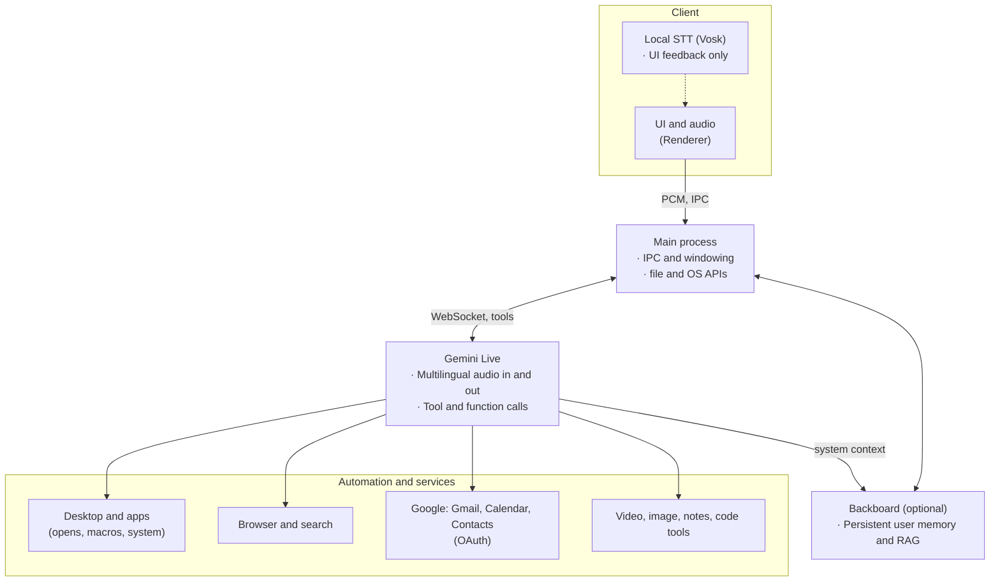

# Caltech-Hackathon-2026

# Nova AI

> **YC — Reimagining Zapier for 2026**

Nova is an **AI agent** that learns and executes workflows across any software on your computer—including apps it has never seen before—through **natural language** or **demonstration**. Nova not only connects applications that already have cloud APIs, it also helps people **control and automate the whole desktop**, so anyone can build workflows across **any application** using **any language**.

---

## Architecture

Nova ships as an **Electron** app: a compact voice UI, a main process for OS access, and **Google Gemini Live** for real-time speech, tool use, and voice output.



| Layer                    | Role                                                                                                                                         |
| ------------------------ | -------------------------------------------------------------------------------------------------------------------------------------------- |
| **Renderer**             | Microphone, playback, orb UI; local transcript (Vosk) is for **display**—Gemini still receives raw audio for understanding.                  |
| **Main**                 | Security-sensitive work: file paths, process launch, windowing, and the bridge to [Gemini Live](https://ai.google.dev/) in the main process. |
| **Gemini Live**          | End-to-end voice: intent, **tool calls** into desktop, browser, and Google-integrated features, then spoken replies.                         |
| **Backboard** (optional) | Long-term **memory** and **semantic recall** so user context persists across sessions.                                                       |

_File-level structure, API invariants, and debugging: [DEVELOPERS.md](DEVELOPERS.md)._

---

## Links

| Resource                            | URL                                                                                    |
| ----------------------------------- | -------------------------------------------------------------------------------------- |
| **Website**                         | <https://novatechai.tech/>                                                             |
| **User survey & interview (video)** | <https://drive.google.com/drive/folders/1NNDNxvJNhKSiK3H5IQRu4VVMeUfwyzjj?usp=sharing> |
| **Slide deck**                      | <https://canva.link/r1t51is1wwdz4qe>                                                   |

---

## Quick start

```bash
cd robot-widget
npm install
npm run start
```

|                                        |                                                                                                                                        |
| -------------------------------------- | -------------------------------------------------------------------------------------------------------------------------------------- |
| **Google (email, calendar, contacts)** | In `robot-widget/`: `npm run setup-google` (one-time OAuth).                                                                           |
| **Environment**                        | Copy `robot-widget/.env.example` → `robot-widget/.env`. Set at least `GEMINI_API_KEY`. For persistent memory, add `BACKBOARD_API_KEY`. |
| **macOS / Windows**                    | If the default start script includes Linux-only flags, adjust `package.json` for your platform.                                        |
