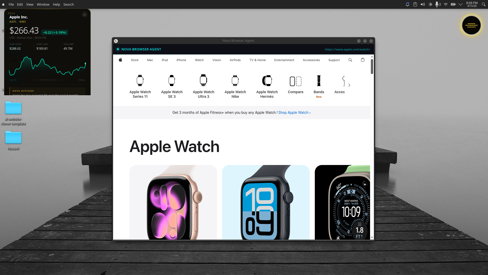
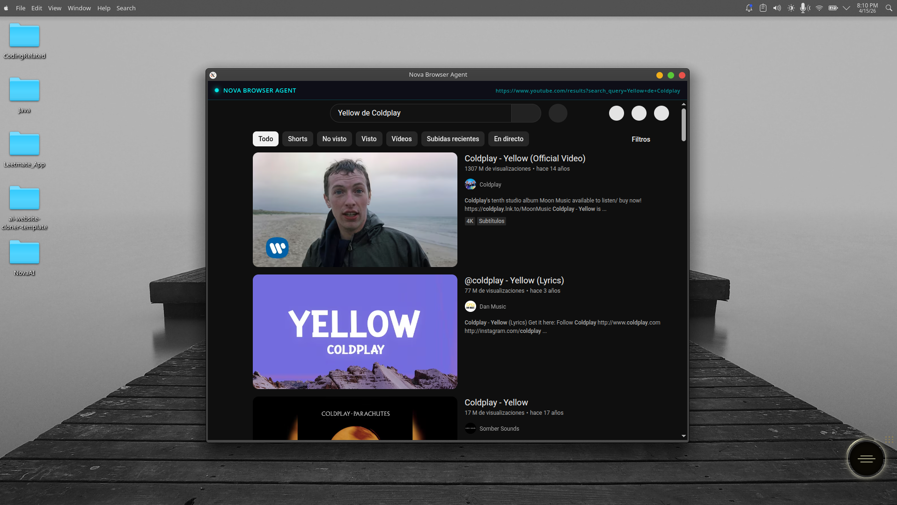
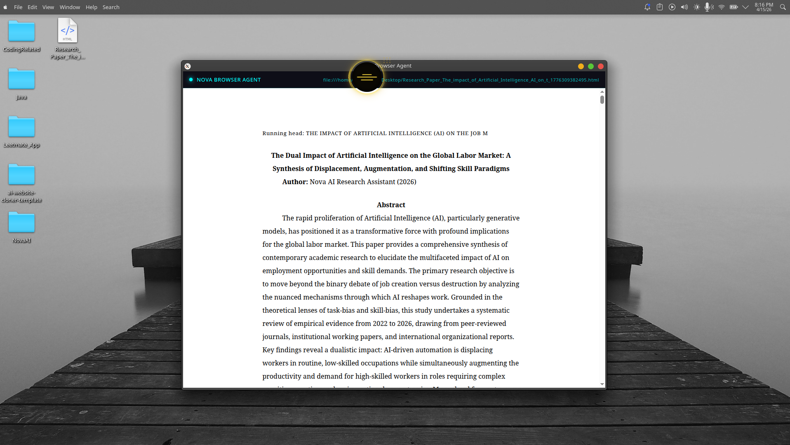
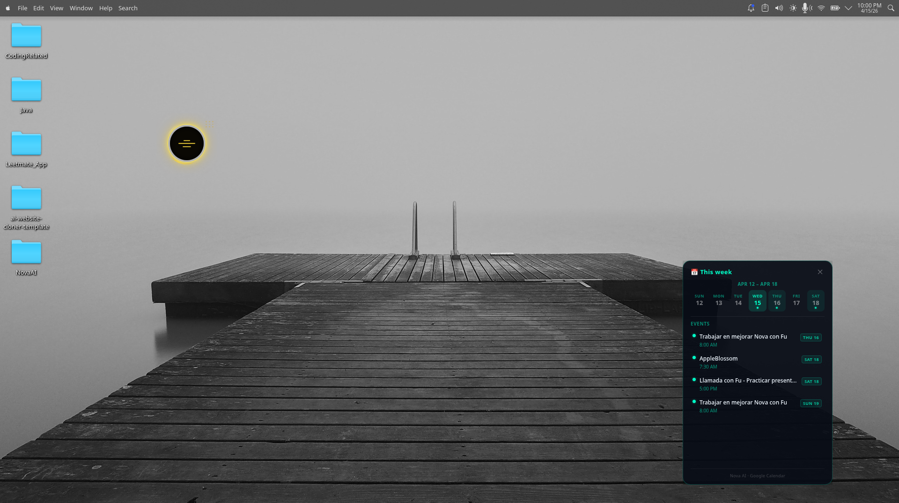
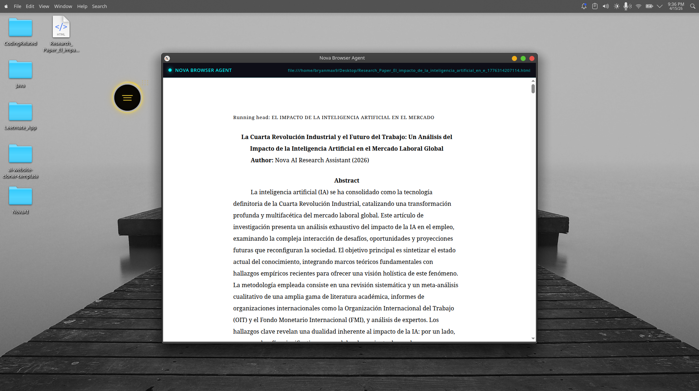
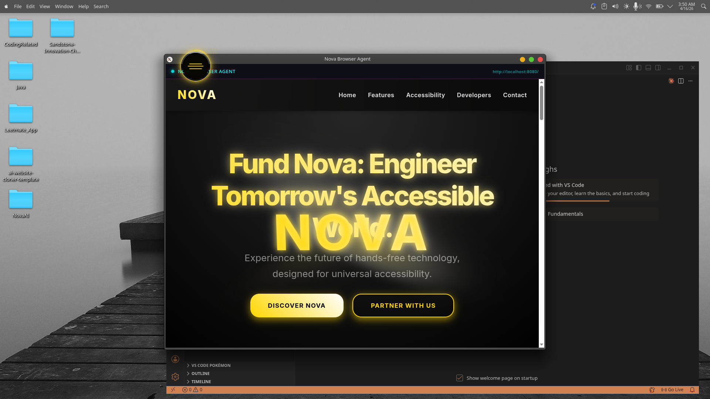

# Caltech-Hackathon-2026

Nova is a **sci-fi AI voice assistant** that lives as a transparent animated orb on your desktop. Powered by **Google Gemini**, Nova listens to your voice in real time, understands natural language, and autonomously controls your entire desktop — opening browsers, sending emails, managing your calendar, writing and running code projects, checking stocks, and much more.

---

## Preview

<p align="center">
  
  
  
</p>
<p align="center">
  
  
  
</p>

---

## Table of Contents

1. [How It Works](#how-it-works)
2. [Architecture Overview](#architecture-overview)
3. [File Structure](#file-structure)
4. [Features](#features)
5. [System Requirements](#system-requirements)
6. [Installation & Setup](#installation--setup)
7. [Google Services Setup (Gmail + Calendar)](#google-services-setup-gmail--calendar)
8. [Running Nova](#running-nova)
9. [First Launch](#first-launch)
10. [Example Voice Commands](#example-voice-commands)
11. [Tech Stack](#tech-stack)
12. [Rebuilding from Scratch (Claude Reference)](#rebuilding-from-scratch-claude-reference)

---

## How It Works

Nova is built on four tightly integrated layers:

### 1. Voice Input (Local + Streaming)

**Offline recognition (Vosk):**  
Nova runs a local 40 MB Kaldi acoustic model (`vosk-browser`) directly in the Electron renderer. It captures your microphone at 16 kHz mono and continuously produces partial and final transcripts — all on-device, with zero latency and zero data leaving your machine. Both English (`vosk-model/`) and Spanish (`vosk-model-es/`) models are included.

**Wake word / activation:**  
When Vosk detects your wake phrase (e.g. _"Hey Nova"_ or _"Nova"_), it wakes the assistant and starts streaming raw PCM audio to the Gemini Live session.

**Gemini Live streaming:**  
Once awake, every mic audio chunk is base64-encoded and piped over IPC (`live-audio-chunk`) to the main process, which forwards it in real time to **`gemini-3.1-flash-live-preview`** via the Gemini Multimodal Live WebSocket API. The session receives audio turns and emits audio replies + optional tool calls. The session auto-sleeps after 5 minutes of silence and reconnects on unexpected drops while the assistant is awake.

---

### 2. AI Brain (Google Gemini)

Nova uses several Gemini models for different tasks:

| Task                                 | Model                                          | File            |
| ------------------------------------ | ---------------------------------------------- | --------------- |
| Real-time voice conversation + tools | `gemini-3.1-flash-live-preview`                | `live.js`       |
| Text chat with conversation history  | `gemini-2.5-flash`                             | `gemini.js`     |
| Text-to-speech synthesis             | `gemini-2.5-flash-preview-tts`                 | `tts.js`        |
| Audio transcription (batch)          | `gemini-2.5-flash`                             | `stt.js`        |
| Research paper generation            | `gemini-2.5-pro` → fallback `gemini-2.5-flash` | `main.js`       |
| Natural language time parsing        | `gemini-2.5-flash`                             | `calendar.js`   |
| Code generation / modification       | `gemini-2.5-flash`                             | `code_agent.js` |

**System identity:**  
Gemini is given a comprehensive system prompt defining Nova as an autonomous desktop assistant. During a live session, the model can both speak back (audio response) and call desktop-control tools in the same turn.

**Cooldown / debounce guards:**  
`live.js` uses three separate debounce maps to prevent Gemini from looping tool calls triggered by ambient audio:

- `lastExecCommandMap` — 15 s per-command cooldown for `execute_system_command`
- `_codeAgentDebounce` — per-action cooldowns (generate=120 s, modify=60 s, others=10–15 s)
- `_calendarDebounce` — 12 s per-calendar-key cooldown
- Research paper: 10-minute cooldown after completion in both `live.js` and `renderer.js`
- Browser close: 10 s lockout after explicit close; browser actions blocked for 2 min after a paper opens

---

### 3. Desktop Automation Engine

When Gemini decides to take an action, it emits a **function call**. Nova's `live.js` handles these tool calls and executes them on your machine via the `Automation` class defined in `main.js`.

#### Browser Control (`control_browser` tool)

- **open** — Resolves a search query or URL and loads it in the built-in Nova Browser Agent window (Electron `<webview>` inside `browser.html`).
- **scroll** — Injects scroll actions (up/down/top/bottom) into the active webview.
- **smart_click** — Reads the live DOM map of the page (element text + tag) and clicks elements by visible text using fuzzy matching.
- **search_youtube** — Opens YouTube with the given query.
- **toggle_incognito** — Switches the embedded browser into or out of incognito mode.
- **close** — Hides the browser window.
- **Store Assistant Mode** — When the loaded URL matches a known shopping domain (Apple, Amazon, eBay, Best Buy, Nike, etc.), Nova automatically enters Store Mode: it scans the DOM, describes the visible products out loud, and guides the user through navigation → selection → add-to-cart with stuck-navigation detection.

#### OS & App Control (`execute_system_command` tool)

- **Open / close apps** — Uses `osascript` (macOS), PowerShell (Windows), or `xdg-open`/`xdotool`/`wmctrl` (Linux) to launch and quit applications by name. A 30+ app alias map covers common names like "zoom", "vscode", "terminal", "discord", etc.
- **Volume control** — `pactl set-sink-volume` on Linux, `osascript` on macOS, PowerShell on Windows.
- **Media keys** — Play/pause, next/previous track via `playerctl` on Linux.
- **Run shell commands** — Executes arbitrary terminal commands; result returned to AI.
- **Screenshot + vision** — Captures the screen via Electron `desktopCapturer`, sends PNG base64 to Gemini for visual analysis.

#### Research & Content Generation (`create_research_paper` tool)

- Triggered **only** by explicit creation verbs ("write/create/generate/make") + the words "research paper" + a topic.
- 4 academic web searches via Gemini's `googleSearch` grounding tool → `gemini-2.5-pro` (with 2× retry + fallback to flash on 503) writes a full APA-formatted HTML paper → saved to the user's Desktop → opened in Nova's browser.
- `global.novaIsResearching` flag blocks duplicate triggers. 10-minute cooldown after completion.

#### Stock Charts (`show_stock_chart` tool)

- Queries Yahoo Finance REST API for real-time price, 3-month daily close data, 52-week range, and volume.
- Opens a floating transparent 340×340 `stock.html` window (canvas chart) in the top-left corner.
- Nova automatically moves to the top-right corner while the chart is open (so neither element overlaps).
- If no ticker symbol is known, queries Yahoo Finance search to resolve company name → symbol.

---

### 4. Google Services Layer

#### Gmail (`gmail.js`)

Nova can compose and send emails via voice. It uses OAuth2 (`google_auth.js`) to authenticate with your Gmail account. Key capabilities:

- **Send emails** — Compose and send by voice: _"Send an email to Bryan about the meeting tomorrow"_
- **Contact resolution** — Searches your sent mail history to resolve a person's name to their email address (no manual contacts list needed). Runs three Gmail search queries (`to:"name"`, `from:"name"`, full text in sent) and ranks results by frequency.
- **Draft mode** — Pass `draft_only: true` to save as a Gmail draft instead of sending immediately.

#### Google Calendar (`calendar.js`)

Nova manages your calendar entirely by voice using the Google Calendar API:

- **Get events** — _"What's on my calendar this week?"_ — Uses Gemini to parse natural language time expressions (e.g. _"next Friday"_, _"this month"_) into ISO 8601 date ranges. Default: "this week".
- **Create events** — _"Schedule a meeting with John tomorrow at 3pm"_ — Conflict detection built in; alerts if another event overlaps.
- **Delete events** — _"Cancel my dentist appointment"_ — Fuzzy-matches the event title by searching within the given time window.
- **Check availability** — _"Am I free Thursday afternoon?"_ — Scans 8am–8pm and returns free windows.
- **Calendar UI panel** — A glassmorphism floating panel (`calendar_panel.html`) shows today's events at a glance; voice or click to open. The panel is its own `BrowserWindow` with `nodeIntegration` and calls `ipcRenderer.invoke('calendar-get-events')` on load.

#### Code Agent (`code_agent.js`)

Nova can build full coding projects from scratch entirely by voice:

- **start_session** — Activates code agent mode; announces it to the user.
- **list_projects** — Lists all folder names on the user's Desktop (reads via `fs.readdirSync`).
- **create_project** — Creates a new folder on the Desktop with a sanitized name. Stores path in `_projectPath`.
- **open_project** — Fuzzy-matches a project name against Desktop folders (score 0–100, threshold 50). Opens VS Code via `code --new-window <path>` (cross-platform). Auto-detects and starts an existing dev server.
- **generate_code** — Asks Gemini to return a JSON map of `{ "filename": "content" }` for all project files. Writes them all to disk. Starts the appropriate dev server (`vite` for React, built-in `http.Server` for static, `node src/index.js` for APIs). Opens a live preview in Nova's browser.
- **modify_code** — Reads all existing source files via `readProjectFiles()` (walks the directory, skips `node_modules`/`dist`/`.git`). Asks Gemini to return only the changed files as JSON. Overwrites them and hot-reloads the preview.
- **preview_project** — Opens or re-opens the browser at the running dev server URL.
- **end_session** — Closes VS Code, stops dev server processes, closes the browser window.

**Supported project types:** `static_website` (HTML+CSS+JS), `react` (Vite+React 18+TypeScript), `api_only` (Express 4), `fullstack` (React frontend + Express backend with `concurrently`), `cli` (Node.js CLI with Commander), `extension` (Chrome Extension Manifest V3), `python`.

---

## Architecture Overview

```
┌─────────────────────────────────────────────────────────────────────┐
│                        Electron Main Process                        │
│  main.js                                                            │
│  ├── Protocol handler (appassets://)                                │
│  ├── IPC router (all ipcMain.on / ipcMain.handle endpoints)         │
│  ├── Expressive Movement Engine (wander, snap-home, stock-mode)     │
│  ├── Browser Agent window (browser.html — <webview> + DOM map)      │
│  ├── Stock chart window (stock.html + Yahoo Finance REST API)       │
│  ├── Calendar panel window (calendar_panel.html)                    │
│  ├── Chat window (chat.html + chat.js)                              │
│  ├── Research paper generator (gemini-2.5-pro + googleSearch)      │
│  ├── Desktop automation (open apps, volume, media, screenshot)      │
│  ├── Google Auth (google_auth.js — OAuth2 token management)         │
│  ├── Gmail integration (gmail.js — send mail, contact lookup)       │
│  ├── Calendar integration (calendar.js — CRUD + availability)       │
│  └── Code Agent (code_agent.js — generate, modify, preview)        │
│                                                                     │
│  live.js ──── Gemini Multimodal Live WebSocket session              │
│               └── Tool call dispatcher (8 tools, 35+ actions)     │
│  gemini.js ── Gemini text chat with rolling 38-turn history         │
│  tts.js ───── Gemini TTS (PCM → WAV, "Orus" voice profile)         │
│  stt.js ───── Gemini batch audio transcription (WebM → text)       │
└──────────────────────────┬──────────────────────────────────────────┘
                           │ IPC (ipcMain / ipcRenderer)
┌──────────────────────────▼──────────────────────────────────────────┐
│                      Electron Renderer Process                      │
│  index.html + renderer.js                                           │
│  ├── Animated CSS orb (transparent 120×120 overlay widget)         │
│  │    States: offline → idle → listening → thinking → speaking      │
│  ├── Vosk — offline 16 kHz mic → wake word detection               │
│  │    English model: vosk-model/   Spanish: vosk-model-es/          │
│  ├── Gemini Live audio stream → IPC → main process                 │
│  └── novaState poll → orb CSS class every 100 ms                   │
└─────────────────────────────────────────────────────────────────────┘

Key IPC channels (renderer → main):
  drag-start / drag-move / drag-end      Widget dragging
  nova-bounce-start / stop               Wander motion on/off
  nova-move-state  (mode)                listening | speaking | thinking
  live-start / live-audio-chunk / live-end  Gemini Live audio pipeline
  open-chat                              Open text chat window
  browser-get-map                        Request DOM snapshot from webview
  dom-map-available                      Webview sends back element map

Key IPC channels (main → renderer):
  live-audio-response  (base64)          Play Gemini audio reply
  nova-speak           (text)            TTS playback trigger
  automation-log       (message)         Status updates in overlay

Key IPC handles (invoke):
  generate-speech      (text)            → tts.js → WAV file path
  ask-grok             (text)            → gemini.js → reply text
  calendar-get-events                    → calendar.js → events array
  open-calendar-panel                    → creates calendarWin
  coding-done          (payload)         → code agent result to renderer
```

---

## File Structure

```
NovaAI/
└── robot-widget/
    ├── main.js               Electron main — IPC router, all windows, automation, research paper
    ├── renderer.js           Renderer — CSS orb states, Vosk wake word, Gemini Live audio pipeline
    ├── live.js               Gemini Live session (gemini-3.1-flash-live-preview) + 8 tool handlers
    ├── gemini.js             Gemini text chat (gemini-2.5-flash, rolling 38-turn history)
    ├── tts.js                Gemini TTS (gemini-2.5-flash-preview-tts) → raw PCM → WAV file
    ├── stt.js                Gemini batch transcription — WebM buffer → text string
    ├── google_auth.js        Google OAuth2 — token load/save/refresh, isAuthenticated guard
    ├── gmail.js              Gmail API — send mail, contact name → email lookup
    ├── calendar.js           Google Calendar API — CRUD events, availability, NL time parse
    ├── code_agent.js         Code Agent — project scaffold, modify, VS Code, dev server, preview
    ├── index.html            Main overlay window — animated orb CSS + widget markup
    ├── browser.html          Nova Browser Agent — Electron <webview> + DOM map injector
    ├── chat.html             Text "Comms" chat window markup
    ├── chat.js               Chat window renderer — sends to Gemini, plays TTS reply
    ├── calendar_panel.html   Floating calendar UI panel (glassmorphism design)
    ├── stock.html            Floating stock chart window (canvas-based chart)
    ├── package.json          Electron app config + npm scripts + dependencies
    ├── .env                  API keys (not committed — see setup below)
    ├── scripts/
    │   └── setup_google_auth.js   Interactive Google OAuth2 setup wizard
    ├── credentials/
    │   └── google_token.json      Saved OAuth token (auto-created after setup)
    ├── assets/
    │   ├── novaPreview1-6.png     UI screenshots used in this README
    │   └── voice/                 TTS audio cache (response_N.wav, rotated 0–11)
    ├── vosk-model/                English offline speech recognition model (~40 MB)
    └── vosk-model-es/             Spanish offline speech recognition model
```

---

## Features

| Feature                      | Description                                                                     |
| ---------------------------- | ------------------------------------------------------------------------------- |
| Real-time voice conversation | Gemini Multimodal Live WebSocket — speak and get spoken replies                 |
| Offline wake word            | Local Vosk model (English + Spanish) — no cloud round-trip for wake detection   |
| Full browser control         | Open, navigate, scroll, smart-click, incognito toggle, close — all by voice     |
| Store Assistant Mode         | Auto-activates on 20+ shopping sites — guides browse → select → add-to-cart     |
| Desktop app control          | Open/close/focus any app on macOS, Windows, and Linux                           |
| Volume & media control       | Set volume, play/pause, next/previous track                                     |
| Shell command execution      | Run any terminal command, result returned to AI                                 |
| Screen vision                | Screenshot → Gemini describes what's on your screen                             |
| Gmail integration            | Send emails by voice with automatic contact name resolution                     |
| Google Calendar              | Get, create, delete events; check free slots; natural language time parsing     |
| Calendar UI panel            | Floating glassmorphism panel showing today's schedule                           |
| Code Agent                   | Generate full projects (React, Python, HTML, etc.) with live preview in VS Code |
| Stock charts                 | Real-time price + 3-month chart via Yahoo Finance (no API key needed)           |
| Research paper generation    | Web-grounded Gemini writes an HTML paper saved to your Desktop                  |
| Gemini TTS                   | Natural voice synthesis using the "Orus" deep sci-fi voice profile              |
| Expressive movement          | Nova wanders organically around your screen during conversation                 |
| Draggable overlay            | Click-drag to reposition Nova anywhere on screen                                |
| Double-click chat            | Opens a text chat window (fallback to typed input)                              |
| Cross-platform               | macOS, Windows, Linux (X11)                                                     |

---

## System Requirements

- **Node.js** v18 or higher
- **npm** (bundled with Node.js)
- **Google Gemini API key** — with access to `gemini-3.1-flash-live-preview` (Gemini Live) and `gemini-2.5-flash`
- **Google Cloud OAuth credentials** _(optional — required for Gmail + Calendar only)_

**Linux only (for desktop automation):**

- `xdotool` or `wmctrl` — window focus / input automation
- `pactl` — volume control (PulseAudio/PipeWire)
- `playerctl` — media key control
- X11 display server (Wayland is not supported — app forces X11 via `ELECTRON_OZONE_PLATFORM_HINT=x11`)

**For Code Agent (live preview):**

- `code` CLI in PATH — VS Code must be installed and the `code` shell command available
- `vite` — auto-installed in generated React projects via `npx`

---

## Installation & Setup

### 1. Clone the repository

```bash
git clone <your_repository_url>
cd NovaAI/robot-widget
```

### 2. Install dependencies

```bash
npm install
```

### 3. Create your `.env` file inside `robot-widget/`

```env
# Required — Gemini AI
GEMINI_API_KEY=your_google_gemini_api_key_here

# Required for Gmail + Calendar features
GOOGLE_CLIENT_ID=your_google_oauth_client_id
GOOGLE_CLIENT_SECRET=your_google_oauth_client_secret
GOOGLE_REDIRECT_URI=http://localhost:3141/oauth2callback
```

**How to get a Gemini API key:**  
Visit [Google AI Studio](https://aistudio.google.com/) and create an API key with access to Gemini Live (`gemini-3.1-flash-live-preview`) and `gemini-2.5-flash`.

---

## Google Services Setup (Gmail + Calendar)

Gmail and Calendar require a one-time OAuth2 authorization. This is **optional** — Nova works without it, but voice email and calendar commands will return an auth prompt instead.

### Step 1 — Create Google Cloud OAuth credentials

1. Go to [Google Cloud Console](https://console.cloud.google.com/)
2. Create or select a project
3. **APIs & Services → Library** → enable **Gmail API** and **Google Calendar API**
4. **APIs & Services → Credentials → Create Credentials → OAuth 2.0 Client ID**
5. Choose **Desktop app** as the application type
6. Copy the **Client ID** and **Client Secret** into your `.env` file
7. Add `http://localhost:3141/oauth2callback` as an authorized redirect URI
8. If your OAuth consent screen is in "Testing" mode, add your Google account as a test user

### Step 2 — Run the authorization wizard

```bash
npm run setup-google
```

This opens a browser window to authorize Nova. After approval, a token is saved to `credentials/google_token.json`. **Restart Nova after this step.**

> The token is saved locally and never leaves your machine. Nova checks `isAuthenticated()` before any API call — if no token exists, it returns a helpful spoken message instead of crashing.

---

## Running Nova

```bash
cd robot-widget
npm start
```

Nova appears as a small animated orb in the bottom-right corner of your screen. It stays on top of all other windows and is transparent between interactions.

---

## First Launch

Chromium enforces a WebAudio autoplay policy. On first launch:

1. Watch the top-left status log — it will show `⚠️ Click the orb once to activate Voice AI`.
2. **Click the orb once** to unlock microphone access.
3. You will see the orb transition from its dim offline state to the active idle animation.
4. Say **"Hey Nova"** followed by your command.

---

## Example Voice Commands

**Browser & Web**

- _"Hey Nova, open YouTube and search for lo-fi music"_
- _"Nova, go to GitHub.com"_
- _"Hey Nova, scroll down"_
- _"Nova, close the browser"_
- _"Hey Nova, switch to incognito mode"_

**Shopping (Store Assistant Mode)**

- _"Hey Nova, open apple.com"_ → Nova enters store mode and guides you
- _"Nova, show me the iPhone 16 Pro"_
- _"Hey Nova, add to cart"_

**Apps & System**

- _"Hey Nova, open Spotify"_
- _"Nova, turn up the volume"_
- _"Hey Nova, take a screenshot and tell me what you see"_
- _"Nova, close VS Code"_
- _"Hey Nova, run ls -la in terminal"_

**Gmail**

- _"Hey Nova, send an email to Bryan and tell him the meeting is at 3pm"_
- _"Nova, email John about the project update"_

**Google Calendar**

- _"Hey Nova, what's on my calendar today?"_
- _"Nova, schedule a dentist appointment for Thursday at 10am"_
- _"Hey Nova, cancel my 2pm meeting tomorrow"_
- _"Nova, am I free Friday afternoon?"_
- _"Hey Nova, show me my calendar"_

**Code Agent**

- _"Hey Nova, build me a React to-do app"_
- _"Nova, create a Python script that reads CSV files"_
- _"Hey Nova, add dark mode to my project"_
- _"Nova, open my portfolio project"_
- _"Hey Nova, I'm done coding"_

**Stocks & Finance**

- _"Hey Nova, show me Apple's stock chart"_
- _"Nova, what's Tesla's stock doing?"_
- _"Hey Nova, when will Nintendo Switch prices drop?"_

**Research**

- _"Hey Nova, write a research paper on quantum computing"_
- _"Nova, generate an academic paper about climate change"_

**Conversation**

- _"Hey Nova, what's the weather like today?"_
- _"Nova, explain how transformers work in machine learning"_

---

## Tech Stack

| Layer                   | Technology                                                                |
| ----------------------- | ------------------------------------------------------------------------- |
| Desktop app shell       | Electron v41                                                              |
| Widget UI               | CSS animations (orb states: offline, idle, listening, thinking, speaking) |
| Offline STT / wake word | Vosk (`vosk-browser` — English + Spanish models)                          |
| AI voice conversation   | Google Gemini Live (`@google/genai` — `gemini-3.1-flash-live-preview`)    |
| AI text + tools         | Google Gemini Flash (`gemini-2.5-flash`)                                  |
| Research paper AI       | Google Gemini Pro (`gemini-2.5-pro` → fallback `gemini-2.5-flash`)        |
| Text-to-speech          | Google Gemini TTS (`gemini-2.5-flash-preview-tts`, "Orus" voice)          |
| Gmail integration       | Google APIs (`googleapis` — Gmail v1)                                     |
| Calendar integration    | Google APIs (`googleapis` — Calendar v3)                                  |
| Google OAuth            | `google.auth.OAuth2` + token persistence                                  |
| Desktop automation      | OS-native (osascript / PowerShell / xdotool / wmctrl / pactl / playerctl) |
| Stock data              | Yahoo Finance REST API (no auth required)                                 |
| Code generation         | Gemini 2.5 Flash — full project scaffolding in one prompt                 |
| Live code preview       | Built-in Node.js `http.Server` (static) / Vite (React) / Express (API)    |

---

## Rebuilding from Scratch (Claude Reference)

This section is an exact implementation blueprint. Follow the phases in order — each phase depends on the previous one being complete and working.

### Environment Variables

```env
GEMINI_API_KEY            # Google Gemini API key (required for everything)
GOOGLE_CLIENT_ID          # OAuth2 Client ID (required for Gmail + Calendar)
GOOGLE_CLIENT_SECRET      # OAuth2 Client Secret (required for Gmail + Calendar)
GOOGLE_REDIRECT_URI       # http://localhost:3141/oauth2callback (hardcoded port)
```

---

### Phase 1 — Electron Shell

**`package.json`**

```json
{
  "name": "robot-widget",
  "main": "main.js",
  "scripts": {
    "start": "electron . --no-sandbox --disable-gpu-sandbox --enable-transparent-visuals --enable-logging --ozone-platform=x11",
    "setup-google": "node scripts/setup_google_auth.js"
  },
  "dependencies": {
    "@google/genai": "^1.48.0",
    "dotenv": "^17.3.1",
    "googleapis": "^144.0.0",
    "vosk-browser": "^0.0.8"
  },
  "devDependencies": { "electron": "^41.2.0" }
}
```

**`main.js` — window creation**

- Force X11 on Linux: `process.env.ELECTRON_OZONE_PLATFORM_HINT = 'x11'` before `app.ready`.
- `app.commandLine.appendSwitch('autoplay-policy', 'no-user-gesture-required')` — disables Chromium autoplay block (needed for TTS).
- Register `appassets://` protocol as privileged + `supportFetchAPI`.
- Create main `BrowserWindow`: 130×130, `transparent: true`, `frame: false`, `alwaysOnTop: true`, `skipTaskbar: true`, `type: 'toolbar'` on Linux. `webPreferences: { nodeIntegration: true, contextIsolation: false, webSecurity: false }`.
- `mainWindow.setAlwaysOnTop(true, 'screen-saver')` after creation.
- `ipcMain.on('drag-start/move/end')` — stores `dragOffset`, calls `win.setBounds()`.

**`index.html`**

- Pure CSS animated orb. No framework. `background: transparent`, `overflow: hidden`.
- `#widget` element: 120×120 px with `.offline`, `.listening`, `.speaking`, `.thinking` CSS classes.
- Visual layers inside the orb: `#arc` (spinning conic-gradient ring), `#arc2` (ghost counter-arc), `#ring` (crisp static border), `#core` (inner glow sphere), `#dot` (center pulsing dot).
- Load `vosk-browser/dist/vosk.js` as a normal `<script>` tag first, then load `renderer.js` as `type="module"`.

**`renderer.js` — orb state machine**

- `window.novaState` object: `{ isAwake, isInConversation, isSpeaking, isProcessingCommand, isResearching, ... }`.
- `setInterval(() => setOrbState(...), 100)` — polls `novaState` and updates `#widget` CSS class.
- Drag: `mousedown/mousemove/mouseup` → IPC `drag-start/move/end`.
- `dblclick` → IPC `open-chat`.

---

### Phase 2 — Voice Pipeline

**`stt.js`** — `transcribeAudio(buffer)`

- Accepts a raw WebM/Ogg `Buffer` from `MediaRecorder`.
- Sends base64 to `gemini-2.5-flash` with `mimeType: 'audio/webm'` and a transcription instruction.
- Returns plain text string.

**`tts.js`** — `generateSpeech(text, relativeOutputPath)`

- Calls `gemini-2.5-flash-preview-tts` with `responseModalities: ['AUDIO']`, voice name `'Orus'`.
- Response is raw 16-bit little-endian PCM at 24 kHz, mono. **There is NO WAV header in the response.**
- Build a 44-byte RIFF/WAV header manually (`pcmToWav()`) and prepend it. Write to disk.
- Returns the relative output path.

**`gemini.js`** — `askGemini(text)`

- Stateful chat with `history = []` array of `{ role, parts }` turns.
- Rolling window: if `history.length > 38`, slice to last 38.
- Returns `response.text`.

**`renderer.js` — Vosk wake word loop**

- Load Vosk model: `const model = await Vosk.createModel('./vosk-model/')`.
- Create recognizer: `recognizer = new model.KaldiRecognizer(16000)`.
- `AudioContext` at 16000 Hz, `ScriptProcessorNode` 4096 samples → on each `onaudioprocess`, convert Float32 to Int16 PCM → `recognizer.acceptWaveform(data)`.
- On `recognizer.result()`: if final transcript contains "nova" or "hey nova" → call `wakeUp()`.
- `wakeUp()`: set `novaState.isAwake = true`, send `live-start` IPC, start forwarding PCM chunks over `live-audio-chunk` IPC.
- On 3+ seconds of silence after wake: send `live-end` IPC, reset state.

---

### Phase 3 — Gemini Live + Tool Calls

**`live.js`** — `startLiveSession(mainWindow, automation)`

- `const model = 'gemini-3.1-flash-live-preview'`
- `ai.live.connect({ model, config: { responseModalities: [Modality.AUDIO], systemInstruction: '...', tools: [...] } })`
- System prompt covers: Nova's personality, strict tool trigger rules for all 8 tools, Store Assistant Mode protocol, shopping flow steps, language rules.
- **8 tools declared:** `get_browser_state`, `control_browser`, `execute_system_command`, `create_research_paper`, `show_stock_chart`, `send_email`, `calendar_action`, `code_agent`.
- On `session.on('toolCall')`: check debounce maps → dispatch to handler → call `session.sendToolResponse({ functionResponses })`.
- On `session.on('serverContent')`: collect audio parts → base64 → `mainWindow.webContents.send('live-audio-response', base64)`.
- Export: `startLiveSession`, `sendAudioChunk`, `sendTextChunk`, `endLiveSession`, `setBrowserOpen`, `setStoreAssistantActive`.

**`main.js` — Live IPC handlers**

- `ipcMain.on('live-start')` → creates `Automation` class instance → calls `startLiveSession(mainWindow, automation)`.
- `ipcMain.on('live-audio-chunk', (event, base64))` → calls `sendAudioChunk(base64)`.
- `ipcMain.on('live-end')` → calls `endLiveSession()`.
- `ipcMain.handle('generate-speech', async (event, text))` → calls `tts.js` → returns WAV path.
- `ipcMain.handle('ask-grok', async (event, text))` → calls `gemini.js` → returns text reply.

---

### Phase 4 — Desktop Automation

**`main.js` — Automation class**

- `execute_system_command` handler: large `if/else` or alias map. Platform-switch for `open`, `close`, `volume`, `media`.
  - Linux open app: `exec('xdg-open ...')` or `spawn('name')`.
  - Linux close: `exec("xdotool search --name 'Window Title' windowclose")`.
  - Volume: `exec('pactl set-sink-volume @DEFAULT_SINK@ 80%')`.
  - Media: `exec('playerctl play-pause')`.
- `capture-screen` IPC: `desktopCapturer.getSources({ types: ['screen'] })` → PNG base64 → Gemini for description.

**`browser.html`** — Nova Browser Agent window

- Full-screen `BrowserWindow` with `<webview>` element.
- On `new-url` IPC: `webview.loadURL(url)`.
- On `inject-script` IPC: `webview.executeJavaScript(script)` for scroll and DOM map extraction.
- DOM map extraction: walks `document.querySelectorAll('a,button,input,select,h1,h2,h3,label')`, collects `{ tag, text, id, href }`, sends back over IPC as `dom-map-results`.
- `webview.addEventListener('did-navigate')` → sends `url-changed` IPC → main.js checks store patterns.

**Store detection in `main.js`**

- Array of `{ re, name }` patterns covering 20+ retailers.
- On `url-changed`: if URL matches any pattern → set `_storeAssistantActive = true` → inject `[STORE DETECTED]` text into live session → call `runStoreAutoScan()`.
- `runStoreAutoScan()`: reads DOM map → extracts headings and price signals (up to 20 elements) → injects a narration prompt telling Gemini to describe products out loud.
- Stuck-navigation detection: if `smart_click` leaves URL unchanged twice in a row → inject a `[NAVIGATION STUCK]` message with direct URL patterns for common stores.

---

### Phase 5 — Google Services

**`google_auth.js`**

- `createOAuth2Client()`: reads `GOOGLE_CLIENT_ID` and `GOOGLE_CLIENT_SECRET` from env. Redirect URI hardcoded as `http://localhost:3141/oauth2callback`.
- `loadToken()` / `saveToken()`: reads/writes `credentials/google_token.json`.
- `isAuthenticated()`: returns `true` if token file exists.
- `getAuthClient()`: loads token → sets credentials → checks expiry → refreshes if needed → on no token, opens browser OAuth flow via `waitForOAuthCode()` (spins up a temporary HTTP server on port 3141).
- `initialize(shellOpenFn)`: must be called from `main.js` with `shell.openExternal` before any OAuth flow.

**`scripts/setup_google_auth.js`**

- Standalone Node script (not Electron). Calls `googleAuth.initialize(openUrl)` then `getAuthClient()` to trigger the full OAuth browser flow and save the token. Run once before first use.

**`gmail.js`**

- `searchContacts(name)`: runs 3 Gmail search queries (`to:"name" in:sent`, `from:"name"`, `"name" in:sent`), parses `To/From/Cc` headers, scores by frequency, returns best match `{ email, displayName }`.
- `sendEmail({ to, subject, body })`: base64url-encodes a raw RFC 2822 MIME message, calls `gmail.users.messages.send`. If `draft_only` is true, calls `gmail.users.drafts.create` instead.
- `handleSendEmailTool(args)`: top-level called from `live.js`. Calls `searchContacts` to resolve `recipient_name`, uses Gemini to expand `message_intent` into a full email body, then calls `sendEmail`.

**`calendar.js`**

- `parseNaturalTime(utterance)`: asks `gemini-2.5-flash` to convert natural language to `{ start, end }` ISO 8601 JSON. Detects user timezone with `Intl.DateTimeFormat().resolvedOptions().timeZone`.
- `getEventsInRange(start, end)`: calls `calendar.events.list`, returns formatted event strings.
- `createEvent({ title, start, end, attendees })`: calls `calendar.events.insert` with conflict check.
- `deleteEvent({ title, timeExpression })`: `parseNaturalTime` → lists events in range → fuzzy-matches title → calls `calendar.events.delete`.
- `findFreeSlots(timeExpression)`: scans 8am–8pm in 30-min intervals for gaps.
- `handleCalendarActionTool(args)`: dispatches by `args.action` to the above functions.

**`calendar_panel.html`** — Floating calendar UI

- Standalone `BrowserWindow` (400×500). `nodeIntegration: true`, `contextIsolation: false`.
- Pure CSS glassmorphism panel with `background: rgba(8,12,22,0.93)`, `border: 1px solid rgba(0,255,200,0.22)`.
- On load: `ipcRenderer.invoke('calendar-get-events')` → renders today's events as a list.
- In `main.js`: `ipcMain.handle('calendar-get-events')` calls `calendar.getEventsInRange(today, endOfDay)`.
- `ipcMain.on('open-calendar-panel')`: creates `calendarWin` if not already open.

---

### Phase 6 — Stock Charts

**`stock.html`** — Floating chart window

- Standalone 340×340 `BrowserWindow`: `transparent: true`, `frame: false`, `alwaysOnTop: true`, top-left position.
- Canvas-based price chart drawn via `CanvasRenderingContext2D`. Plots 3-month daily close prices.
- Receives data via `ipcRenderer.on('stock-data', (event, stockInfo))`. `stockInfo` shape: `{ company, symbol, exchange, currency, price, change, changePct, high52, low52, volume, prices[], firstDate, outlook }`.

**`main.js` — stock handler**

- `showStockChartInternal(company, symbol)`:
  1. If no symbol: `GET https://query1.finance.yahoo.com/v1/finance/search?q=<company>` → extract first quote symbol.
  2. `GET https://query1.finance.yahoo.com/v8/finance/chart/<symbol>?interval=1d&range=3mo` → extract `meta` + `indicators.quote[0].close` prices.
  3. `_snapToTopRight()` — moves Nova to top-right corner.
  4. `createStockWindow()` → `stockWin.webContents.send('stock-data', stockInfo)`.
- `_restoreFromStockMode()`: called when stock window closes → resumes wander if was in conversation, else snaps home.

---

### Phase 7 — Code Agent

**`code_agent.js`** — exported functions

- `listDesktopProjects()`: `fs.readdirSync(desktopPath, { withFileTypes: true })` → filter directories → return names array.
- `fuzzyMatchProject(query, projects)`: scores each project name (exact=100, prefix=82, contains=64, character overlap ≤45). Returns match only if score ≥ 50.
- `createProjectFolder(projectName)`: sanitizes name → `fs.mkdirSync(path, { recursive: true })` → stores in `_projectPath`.
- `openInVSCode(folderPath)`: `spawn('code', ['--new-window', folderPath], { detached: true })`. Falls back to `xdg-open` on Linux failure.
- `waitForPort(port, timeoutMs)`: polls via `net.Socket` every 400 ms until port accepts connections.
- `readProjectFiles(projectPath)`: recursive walk, skips `node_modules/dist/.git/__pycache__/.venv`, reads only known code extensions, skips files > 80 KB.
- `buildGenerationPrompt(name, type, description)`: returns a detailed prompt instructing Gemini to return a JSON object `{ "filename": "file content as string" }` for all project files. Includes exact dependency versions and file structure per `type`.
- `generateProject(args)`: `buildGenerationPrompt` → `gemini-2.5-flash` → `parseJsonResponse` (strips markdown fences) → write all files → `npm install` (if needed) → `openInVSCode` → start dev server → `waitForPort` → return `{ success, projectPath, port, url }`.
- `modifyProject(args)`: `readProjectFiles` → build modification prompt with all existing file contents → Gemini returns only changed files as JSON → write only changed files.
- `startDevServer(projectPath, type)`: spawns the appropriate command per project type. Stores process in `_serverProc` / `_apiProc`.
- `stopSession()`: kills `_serverProc`, `_apiProc`, `_staticServer`, closes VS Code window.

**`main.js` — codeAgentTool dispatcher**

- `automation.codeAgentTool(args)` is the entry point called from `live.js`.
- Dispatches `args.action` to the appropriate `code_agent.js` function.
- `coding-done` IPC: when `generate_code` or `open_project` completes, sends `{ success, url, isExisting }` to renderer. Renderer then injects a summary text into the Gemini Live session.

---

### Phase 8 — Expressive Movement Engine

All in `main.js`. Nova moves organically while in conversation, character driven by emotional state.

**State machine:**

- `_motionMode`: `'listening'` | `'speaking'` | `'thinking'`
- `ipcMain.on('nova-move-state', mode)` — renderer sends this on every state change
- `ipcMain.on('nova-bounce-start')` / `nova-bounce-stop` — turns wander on/off

**Wander loop** (`_startWanderInterval`, 30 ms tick):

- Per-mode parameters: `speed` (lerp factor) and `changeMs` (target change interval).
  - Speaking: slowest (0.012, 5000 ms) — Nova barely moves while talking.
  - Listening: gentle (0.018, 3500 ms).
  - Thinking: slightly restless (0.022, 2200 ms).
- `_pickWanderTarget()` picks a random position in the upper-center area (range shrinks in speaking mode).
- Lerps `_bouncePos` toward target, clamps to screen, calls `mainWindow.setBounds()`.

**Snap home** (`_snapHome`, ~60 fps): ease-out cubic lerp back to bottom-right corner.
**Stock mode** (`_snapToTopRight`): moves Nova to top-right when stock chart is open; restores on close.

---

### Common Gotchas

- **Wayland breaks transparency.** Always set `ELECTRON_OZONE_PLATFORM_HINT=x11` on Linux before `app.ready`. Do this at the very top of `main.js` before any `require`.
- **Chromium autoplay policy.** Requires a user gesture to unlock `AudioContext`. The orb click is that gesture — without it, neither Vosk nor TTS will work. Wire `app.commandLine.appendSwitch('autoplay-policy', 'no-user-gesture-required')` AND keep the "click orb to activate" first-use flow.
- **Gemini Live cooldowns are mandatory.** `live.js` uses `lastExecCommandMap`, `_codeAgentDebounce`, and `_calendarDebounce` to prevent looping tool calls from ambient audio. Remove these and Gemini will hammer the same tool in a tight loop.
- **Google OAuth redirect URI** must be `http://localhost:3141/oauth2callback` in both `.env` and in Google Cloud Console. Port 3141 is hardcoded in `google_auth.js`.
- **TTS output format.** Gemini TTS returns raw PCM (no WAV header). `tts.js` prepends a 44-byte RIFF/WAV header (`pcmToWav()`). Parameters: 24000 Hz, 1 channel, 16-bit PCM. If you change these, update the header writer constants.
- **Research paper model.** Always try `gemini-2.5-pro` first (2 attempts with delay), then fall back to `gemini-2.5-flash` on 503 (model overloaded). Pro produces significantly better papers but hits capacity limits. Never skip the retry logic.
- **Code Agent project types** must be one of the 7 known values: `static_website`, `react`, `api_only`, `fullstack`, `cli`, `extension`, `python`. The generation prompt is deeply specialized per type — other values produce generic output.
- **`browser.html` DOM map** is injected via `webview.executeJavaScript()`. The webview must be fully loaded (`did-stop-loading` or `dom-ready`) before injecting. Always add a 500 ms debounce on `url-changed` events before triggering DOM extraction to avoid reading mid-navigation DOM.
- **`global.novaIsResearching` flag** in `main.js` must be checked AND set before the async research pipeline runs. If you rebuild this, check the flag before starting, set it immediately, and clear it in both the `finally` block and after the 10-minute cooldown expires.
